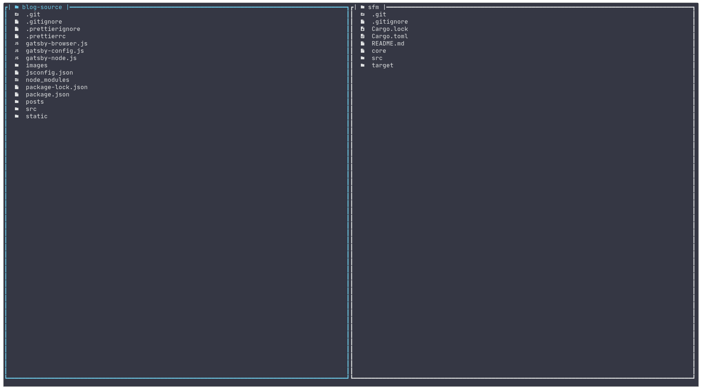

# sfm - simple file manager

> Simple two-panel file manager written in Rust inspired by vim and Total Commander



---

## _Warning: Current status is "work in progress" if you run in some problem please create issue and I will check problem_

## Features:

In order to get icons please install nerd font in your system (on screen Jetbrains Mono Nerd Font Mono)

1. Current features
   - File management
     - Add file or directory
     - Remove file or directory
     - Move file or dir between panels
     - Open file in vi or others editor
     - Rename file or dir
     - Copy file or dir
     - Create symlink
   - Tab management
     - Open as tab (tabs are indicated on top of panel)
     - Navigate between tabs
     - Close tabs
   - Easy toml config file
   - Panel filtering
   - Select multiple items
   - Auto-reload on dir content change

## Keyboard config

- `h` - focus left panel
- `l` - focus right panel
- `j` - next item
- `k` - prev item
- `ctrl + r` - open rename modal
- `ctrl + l` - move selected item from left to right panel
- `ctrl + h` - move selected item from right to left panel
- `ctrl + c` - open create modal on focused panel
- `ctrl + q` - quit program
- `ctrl + o` - open dir in tab
- `ctrl + x` - copy selected item from left panel to right panel
- `ctrl + z` - copy selected item from right panel to left panel
- `ctrl + s` - search in focused panel
- `ctrl + j` - select next item
- `ctrl + k` - select prev item
- `o` - open dir or file(default: vi)
- `n` - next tab
- `p` - prev tab
- `backspace` - navigate to dir parent
- `esc` - close modal
- `enter` - select modal option

## Configuration File

Configuration file should be named `sfm.toml` and should be placed in `~/` or `~/.config` directories.

- ### [core] section

  - tick_rate - update loop interval (default 240)
  - use_icons - turn on/off icons. Icons require NerdFonts to be installed (default false)

- ### [color_scheme] section

  - Color names:
    - foreground
    - background
    - normal_black
    - normal_red
    - normal_green
    - normal_yellow
    - normal_blue
    - normal_magneta
    - normal_cyan
    - normal_white
    - light_black
    - light_red
    - light_green
    - light_yellow
    - light_blue
    - light_magneta
    - light_cyan
    - light_white
  - Color format:
    - Names:
      - Reset
      - Black
      - Red
      - Green
      - Yellow
      - Blue
      - Magneta
      - Cyan
      - Gray
      - DarkGrey
      - LightRed
      - LightGreen
      - LightYellow
      - LightBlue
      - LightCyan
      - White
    - RGB:
      - eg. `foreground = { red = 255, blue = 100, green = 35 }`
    - Indexed
      - eg. `background = 2`

- ### [keyboard_cfg] section

  - Default config
    - `quit = { key = "q", modifier = "C" }`
    - `focus_left_panel = { key = "h" }`
    - `focus_right_panel = { key = "l" }`
    - `move_down = { key = "j" }`
    - `move_up = { key = "k" }`
    - `next_tab = { key = "n" }`
    - `prev_tab = { key = "p" }`
    - `close = { key = "esc" }`
    - `open = { key = "o" }`
    - `open_as_tab = { key = "o", modifier = "C" }`
    - `navigate_up = { key = "backspace" }`
    - `delete = { key = "d", modifier = "C" }`
    - `move_left = { key = "h", modifier = "C" }`
    - `move_right = { key = "l", modifier = "C" }`
    - `rename = { key = "r", modifier = "C" }`
    - `create = { key = "c", modifier = "C" }`
    - `accept = { key = "enter" }`
    - `copy_to_right = { key = "x", modifier = "C" }`
    - `copy_to_left = { key = "z", modifier = "C" }`

- ### [icons_dir] section
  - In order to see icons you need nerd font patch. See in sfm.toml in repo root.
- ### [icons_files] section

  - In order to see icons you need nerd font patch. See in sfm.toml in repo root.

- ### [file_associated_programs] section
  - Key value pair with file extension and programs in default config all files will be opened in `vi`
    - eg. `rs = "nvim"`

## Installation

- Via Cargo

```bash
cargo install sfm

```
